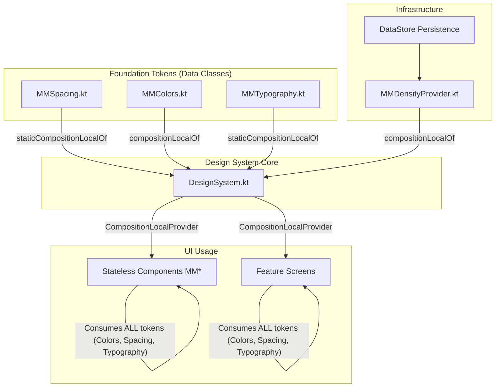

# Implementation Plan - Phase 2: Foundation & Tokens

This plan covers the transition from standard Material 3 tokens to the custom **MeteoMarto Design System (MMDS)** tokens. It orchestrates the work between the Agent (automated implementation) and the User (manual implementation to gain Compose mastery).

## Architecture & Relationships

[Open Architecture Diagram (External file)](file:///Users/AlbertMartorell/Development/Android/MeteoMartoCompose/docs/features/design_system/phase_2_architecture.mermaid)

> [!TIP]
> **How to view diagrams**: If you don't see the diagram below, activate Android Studio's **"Preview"** mode (the rightmost icon in the editor's top bar).

This diagram shows how the Phase 2 components are intertwined:


```

### Explanation of Relationships

1.  **Tokens (`MMSpacing`, `MMColors`, `MMTypography`)**: Pure objects (Data Classes) containing the visual "truth". They are independent of Compose, storing only raw values (Dp, Color, TextStyle). They are **static** in nature; even when switching themes, you just swap one set of static values for another.
2.  **`MMDensityProvider`**: Unlike static tokens, this is **Logic-Driven Infrastructure**. It calculates screen density reactively based on `DataStore` preferences (pinch-to-zoom). It operates at the **Layout/Drawing** phase by overriding `LocalDensity`, transforming `dp` to `px` dynamically.
3.  **`DesignSystem.kt` (The Distributor)**: Where the magic happens. It defines the **`CompositionLocal`** keys (using `staticCompositionLocalOf` or `compositionLocalOf`) and injects token values and density into the composition tree.
4.  **`MeteoMartoTheme`**: The `@Composable` function wrapping the entire app. Internally, it uses **`CompositionLocalProvider`** to bind the values to the keys and make them available at any level of the UI hierarchy without explicit parameter passing.

> [!TIP]
> **`staticCompositionLocalOf` vs `compositionLocalOf`**:
> *   Use **`staticCompositionLocalOf`** for values that rarely change (like Spacing or Typography). If the value changes, Compose recomposes the *entire* subtree, which is expensive but faster for reads.
> *   Use **`compositionLocalOf`** for values that change more frequently (like Colors when switching Light/Dark themes). Compose tracks specific usages, so only affected components recompose.
5.  **Usage**: Any component (`MMPrimaryButton`, etc.) can access `MeteoMartoTheme.spacing.medium` to retrieve the correct value reactively.

## User Review Required

> [!IMPORTANT]
> The user has requested to manually implement **`DesignSystem.kt`**, **`MMTypography.kt`**, and **`MMDensityProvider.kt`** to increase their Compose expertise. The agent will provide the infrastructure and skeletons.

## Proposed Changes

### [Design System Tokens]

We will organize the new tokens under a dedicated package to separate them from the default project theme.

#### [NEW] [MMSpacing.kt](file:///Users/AlbertMartorell/Development/Android/MeteoMartoCompose/app/src/main/java/com/martorell/albert/meteomartocompose/ui/theme/MMSpacing.kt)
*   **Agent Task**: Implement the spacing scale (extraSmall=4dp, small=8dp, medium=16dp, large=24dp, extraLarge=32dp).
*   **Technique**: Use a `data class` to hold the values and `LocalMMSpacing` for propagation.

#### [NEW] [MMColors.kt](file:///Users/AlbertMartorell/Development/Android/MeteoMartoCompose/app/src/main/java/com/martorell/albert/meteomartocompose/ui/theme/MMColors.kt)
*   **Agent Task**: Define semantic color roles mapping Material 3 Expressive palette.
*   **Technique**: Support for Light/Dark modes using `MMColors` data class.

#### [NEW] [MMTypography.kt](file:///Users/AlbertMartorell/Development/Android/MeteoMartoCompose/app/src/main/java/com/martorell/albert/meteomartocompose/ui/theme/MMTypography.kt)
*   **User Task**: Implement Typography using **Roboto Flex Variable Font**.
*   **Agent Action**: Create the file with basic boilerplate and instructions for `FontFamily` and `TextStyle` mapping.

#### [NEW] [DesignSystem.kt](file:///Users/AlbertMartorell/Development/Android/MeteoMartoCompose/app/src/main/java/com/martorell/albert/meteomartocompose/ui/theme/DesignSystem.kt)
*   **User Task**: Create the `CompositionLocal` providers and the main `MeteoMartoTheme` wrapper.
*   **Agent Action**: Create the skeleton highlighting the difference between `staticCompositionLocalOf` and `compositionLocalOf`.

#### [NEW] [MMDensityProvider.kt](file:///Users/AlbertMartorell/Development/Android/MeteoMartoCompose/app/src/main/java/com/martorell/albert/meteomartocompose/ui/theme/MMDensityProvider.kt)
*   **User Task**: Implement the `pinch-to-zoom` logic using `LocalDensity` and `DataStore`.
*   **Agent Action**: Provide the `DataStore` setup and the `CompositionLocal` skeleton for the user to wire up the density override.

## Verification Plan

### Automated Tests
- `analyze_file` on all new Kotlin files.
- Compile check via `./gradlew :app:compileDebugKotlin`.

### Manual Verification
- User implementation of the manual tasks.
- Visual check (Phase 3) once components start using these tokens.
