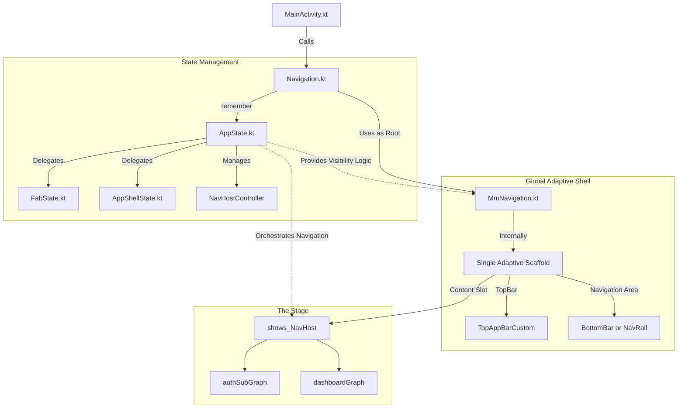

# Navigation Architecture Refinement

This document describes the centralized, adaptive navigation architecture implemented in MeteoMartoCompose.

## Core Principles

1.  **Single Source of Truth**: `AppState.kt` is the sole manager of navigation state, visibility logic, and infrastructure.
2.  **SRP & Composition**: `AppState` delegates specific logic to `FabState` (FAB behavior) and `AppShellState` (UI shell mapping).
3.  **Stateless Screen Mandate**: Individual screens (e.g., `LoginScreen`, `CityWeatherScreen`) are "naked". They must NOT contain `Scaffold`, `TopAppBar`, or `MmNavigation`.
4.  **Root Adaptive Shell**: `Navigation.kt` uses `MmNavigation` (which wraps `NavigationSuiteScaffold`) as the single root container.
5.  **Typed Navigation**: Leveraging Kotlin Serialization for type-safe routing.

## Architecture Diagram

[Open Mermaid Graph in Live Editor](https://mermaid.live/edit#base64:eyJjb2RlIjoiZ3JhcGggVERcbiAgICBNQVtNYWluQWN0aXZpdHkua3RdIC0tPiB8Q2FsbHN8IE5hdltOYXZpZ2F0aW9uLmt0XVxuXG4gICAgc3ViZ3JhcGggQnJhaW4gW1N0YXRlIE1hbmFnZW1lbnRdXG4gICAgICAgIE5hdiAtLT4gfHJlbWVtYmVyfCBBU1tBcHBTdGF0ZS5rdF1cbiAgICAgICAgQVMgLS0+IHxEZWxlZ2F0ZXN8IEZTW0ZhYlN0YXRlLmt0XVxuICAgICAgICBBUyAtLT4gfERlbGVnYXRlc3wgQVNTW0FwcFNoZWxsU3RhdGUua3RdXG4gICAgICAgIEFTIC0tPiB8TWFuYWdlc3wgTkhDW05hdkhvc3RDb250cm9sbGVyXVxuICAgIGVuZFxuXG4gICAgc3ViZ3JhcGggVUlfU2hlbGwgW0dsb2JhbCBBZGFwdGl2ZSBTaGVsbF1cbiAgICAgICAgTmF2IC0tPiB8VXNlcyBhcyBSb290fCBNbU5hdltNbU5hdmlnYXRpb24ua3RdXG4gICAgICAgIE1tTmF2IC0tPiB8SW50ZXJuYWxseXwgU2NhZmZbU2luZ2xlIEFkYXB0aXZlIFNjYWZmb2xkXVxuICAgICAgICBTY2FmZiAtLT4gfFRvcEJhcnwgVEJDW1RvcEFwcEJhckN1c3RvbV1cbiAgICAgICAgU2NhZmYgLS0+IHxOYXZpZ2F0aW9uIEFyZWF8IE5CQVtCb3R0b21CYXIgb3IgTmF2UmFpbF1cbiAgICBlbmRcblxuICAgIHN1YmdyYXBoIENvbnRlbnRfQXJlYSBbVGhlIFN0YWdlXVxuICAgICAgICBTY2FmZiAtLT4gfENvbnRlbnQgU2xvdHwgTkhbc2hvd3NfTmF2SG9zdF1cbiAgICAgICAgTkhMIC0tPiBBU0dbYXV0aFN1YkdyYXBoXVxuICAgICAgICBOSEwgLS0+IERHW2Rhc2hib2FyZEdyYXBoXVxuICAgIGVuZFxuXG4gICAgQVMgLS4tPiB8UHJvdmlkZXMgVmlzaWJpbGl0eSBMb2dpY3wgTW1OYXZcbiAgICBBUyAtLi0+IHxPcmNoZXN0cmF0ZXMgTmF2aWdhdGlvbnwgTkhMIiwibWVybWFpZCI6eyJ0aGVtZSI6ImRlZmF1bHQifSwidXBkYXRlRWRpdG9yIjpmYWxzZSwidmFsaWRhdGVNZXJtYWlkIjpmYWxzZSwidXBkYXRlRGlhZ3JhbSI6ZmFsc2V9)



## State Responsibility (SRP)

- **`FabState.kt`**: Exclusively manages FAB visibility, icon toggling (favorite vs non-favorite), and click actions.
- **`AppShellState.kt`**: Maps navigation routes to UI elements (TopBar titles, back button visibility, bottom bar presence).
- **`AppState.kt`**: The central orchestrator. Holds infrastructure (`NavController`, `SnackbarHostState`) and provides a unified API for the UI.

## Title and Action Mapping

Titles and actions are derived from the current destination.

### AppShellState Mapping

```kotlin
fun getTopAppBarTitle(destination: NavDestination?): Int? {
    return when {
        destination.hasRoute(DashboardScreens.CityWeather::class) -> R.string.city_top_bar_title
        destination.hasRoute(DashboardScreens.Favorites::class) -> R.string.favorite_top_bar_title
        else -> null
    }
}
```

## Best Practices for "Naked Screens"

- **No Local Scaffolds**: Use `Box` or `Column` as the root.
- **Token Spacing**: Use `LocalFndSpacing.current` instead of hardcoded `dp`.
- **Statelessness**: Screens receive lambdas for actions and State for data.

## Migration Before/After

### Before (Nested Scaffolds)
```kotlin
@Composable
fun MyScreen() {
    Scaffold(topBar = { TopAppBar(...) }) { padding ->
        Column(Modifier.padding(padding)) { ... }
    }
}
```

### After (Naked Screen)
```kotlin
@Composable
fun MyScreen(modifier: Modifier = Modifier) {
    Column(modifier.padding(LocalFndSpacing.current.medium)) { ... }
}
```
